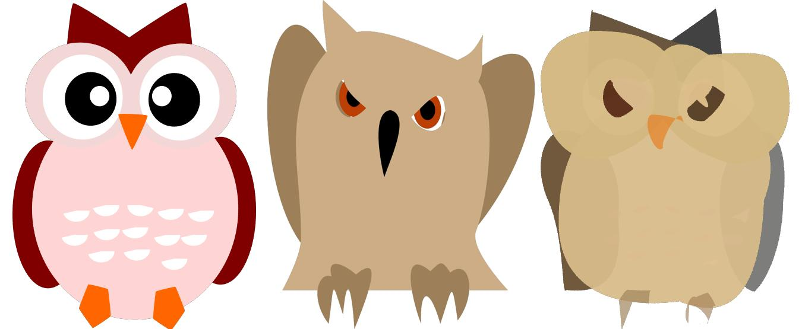
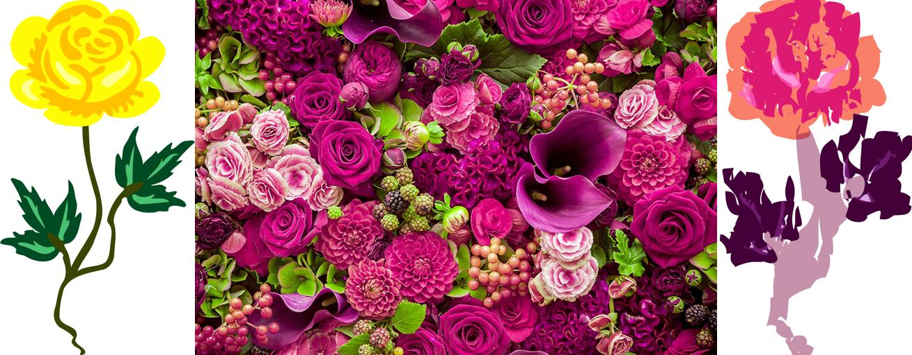

# VectorNST

  
  
  

The official implementation of VectorNST (vector neural style transfer) model in PyTorch.

[Demo service](http://109.188.135.85:5001/vector_style_transfer).

**The code will be published soon.**
